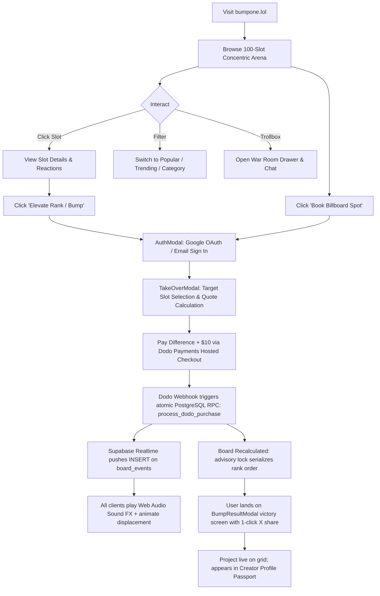
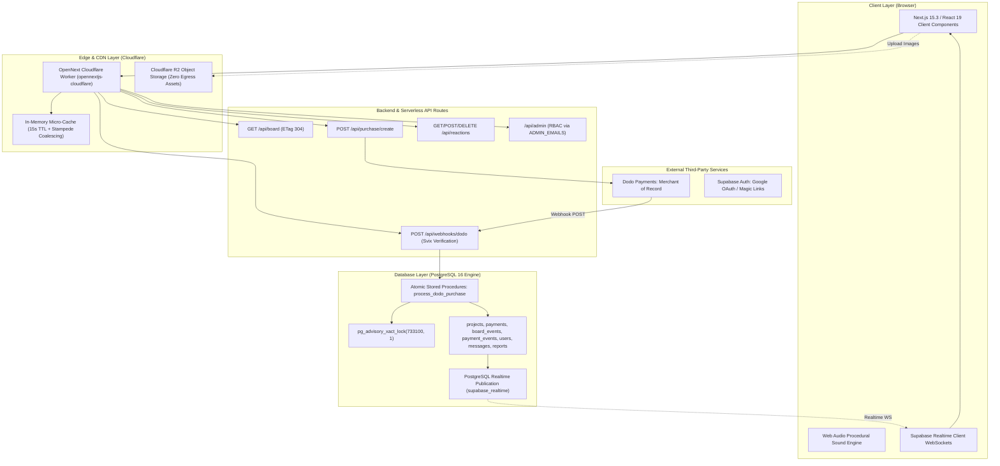
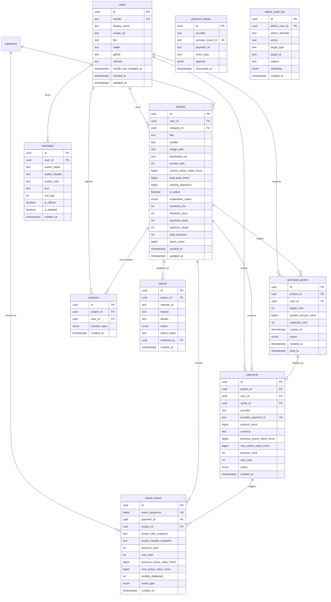

# Comprehensive Architecture & Product Audit: BumpOne.lol

This report provides an exhaustive, code-verified explanation of **BumpOne.lol**. It is structured for you and any AI assistant (such as ChatGPT) to understand the system mechanics, evaluate proposed modifications, and execute future roadmap enhancements without ambiguity.

---

## 1. Product Overview

### What BumpOne Does and Problem Solved
[BumpOne.lol](file:///d:/Work/bumpone.lol/docs/00_PROJECT_OVERVIEW.md) is a real-time, visual **attention marketplace** and developer showcase. It turns digital advertising and product directory listings into a live, competitive spectator arena.

Traditional launch platforms (like Product Hunt or directory sites) suffer from gaming, algorithmic opacity, voter fraud, and rapid obsolescence. BumpOne solves this with **transparent, capital-driven attention equity**:
- Ranks are public and strictly sorted by **Active Value** (dollars paid).
- A participant's investment **never decays or resets**: prior payments carry forward permanently toward higher rankings until another competitor outbids them.
- Position is represented by **physical board real estate** in a concentric bento layout rather than an abstract row on a list.

### Target Users
1. **Indie Hackers & Solopreneurs**: Seeking high-impact, transparent launch exposure without courting upvotes.
2. **Web3 / Crypto & AI Founders**: Promoting dApps, protocols, and developer agents where status, clout, and visual dominance drive viral curiosity.
3. **Tech Creators & Digital Artists**: Claiming digital identity turf with dedicated public profile passports and social share cards.
4. **Spectators & Community**: Engaging through live War Room chat feeds and authenticated emoji reactions.

### BumpOne vs. Outbid.lol
[Outbid.lol](https://outbid.lol) (launched by Jonathan Wilke) popularized the minimalist pay-to-rank concept. BumpOne is an **evolutionary leap** over Outbid:

| Feature / Dimension | Outbid.lol | BumpOne.lol |
| :--- | :--- | :--- |
| **Visual Architecture** | Vertical text list / flat table | **5-Batch Concentric Bento Arena** (King 3×3 center, 4 Champions 2×2, Elites, Vanguard, Contenders) |
| **Visual Scale** | Uniform row height | **Physical Real Estate Dominance**: Rank #1 occupies ~15–20% of the entire screen; lower ranks get smaller tiles |
| **Placement Equity** | Time-window resets (Daily / Today / All-Time) | **Permanent Active Value**: Active value never burns or resets. Your money stays with your project until bumped |
| **Multi-Project Ownership** | Single listing per transaction | **Creator Portfolios**: 1 authenticated creator account can launch, own, and manage multiple projects simultaneously |
| **Community Engagement** | None (pure financial list) | **War Room Trollbox & Authenticated Emoji Reactions** (Fire, Eyes, Heart, Laugh) |
| **Drop Handling** | Disappears or sinks into pagination | **The Billboard Archive (#101+ Graveyard)**: Preserves active value off-board with a 1-click restore mechanism |
| **Procedural Audio** | None | **Zero-asset Web Audio Synthesizer**: Coronation fanfare, shove whooshes, and graveyard drop alarms |
| **Social Virality** | Basic tweet prompt | **Dynamic Share Cards & Visual Victory Screen**: Displaced count, rank delta, and OG cards |

### Core Value Proposition
- **"Claim your turf. Bump everyone below you. Rule the internet's live attention board."**
- Buyers purchase measurable physical prominence. Taking #1 triggers an arena-wide event, notifying participants and broadcasting across live feeds.

### Complete User Journey


---

## 2. Technology Stack & Architecture



### Breakdown of Technologies
- **Frontend Framework**: [Next.js 15.3.0](file:///d:/Work/bumpone.lol/package.json#L19) using App Router, React 19, and TypeScript 5.7.
- **Styling**: Tailwind CSS v4 (`@tailwindcss/postcss`) with CSS containment (`contain: layout style paint`) and dynamic viewport layout engines.
- **Audio Synthesis**: Native HTML5 Web Audio API procedural synthesizer in [src/lib/sound.ts](file:///d:/Work/bumpone.lol/src/lib/sound.ts) (no audio mp3/wav files).
- **Backend Runtime**: Next.js Node.js API routes compiled for Cloudflare Workers via `@opennextjs/cloudflare` ([wrangler.jsonc](file:///d:/Work/bumpone.lol/wrangler.jsonc)).
- **Database**: PostgreSQL 16 hosted on Supabase, managed via 16 migration scripts in [supabase/migrations](file:///d:/Work/bumpone.lol/supabase/migrations).
- **Auth**: Supabase SSR (`@supabase/ssr`) with Google OAuth and email auth, paired with custom database synchronization in [src/lib/userSync.ts](file:///d:/Work/bumpone.lol/src/lib/userSync.ts).
- **Payments**: [Dodo Payments](file:///d:/Work/bumpone.lol/src/lib/dodo.ts) (Merchant of Record) with Svix webhook signature verification.
- **Storage**: Cloudflare R2 bucket (`bumpone-assets`) accessed via `@aws-sdk/client-s3` or OpenNext native worker bindings, with Sharp image processing and EXIF stripping.
- **Real-Time**: Supabase Realtime WebSocket subscriptions over PostgreSQL publication `supabase_realtime` on tables `board_events`, `messages`, and `projects`.
- **In-Memory Cache**: 15-second edge micro-cache with ETag support and promise coalescing to eliminate thundering herds ([src/lib/boardCache.ts](file:///d:/Work/bumpone.lol/src/lib/boardCache.ts)).

---

## 3. Complete Feature Breakdown

### 1. The 100-Slot Concentric Bento Arena Grid
- **What**: A visual mosaic displaying exactly ranks #1 through #100 with zero pixel gaps and zero overlapping cards.
- **Why**: Replaces boring text lists with physical visual hierarchy. Ranks have proportional real estate.
- **Code**: [src/lib/boardLayout.ts](file:///d:/Work/bumpone.lol/src/lib/boardLayout.ts) and [src/components/GridBoard.tsx](file:///d:/Work/bumpone.lol/src/components/GridBoard.tsx).
- **Tiers**:
  - **King (#1)**: Center sovereign anchor (3×3 cells in layout coordinates).
  - **Champions (#2–#5)**: 4 cardinal anchors framing the King (North, South, East, West).
  - **Elite Council (#6–#15)**: 10 inner-ring cards with sky-blue glowing borders.
  - **Vanguard (#16–#40)**: 25 mid-tier cards with emerald borders.
  - **Perimeter Contenders (#41–#100)**: 60 single-cell tiles extending to the #100 drop brink.
- **Performance**: Cells use `content-visibility: auto` and CSS `contain` for ranks > 25 to guarantee 60 FPS scrolling and zooming.

### 2. Exact-Position Purchase & Incremental Bumping Flow
- **What**: Users click any slot or open the takeover modal to buy into the grid or upgrade an existing project.
- **Why**: Allows users to overtake rivals by paying only the delta + $10 minimum increment.
- **Code**: [src/components/TakeOverModal.tsx](file:///d:/Work/bumpone.lol/src/components/TakeOverModal.tsx) and [src/app/api/purchase/create/route.ts](file:///d:/Work/bumpone.lol/src/app/api/purchase/create/route.ts).
- **DB Tables**: Reads `projects`, writes `projects` (draft state), writes `purchase_quotes`.
- **Top-Up Formula**:
  $$\text{TopUp} = \max(\$10, \text{TargetActiveValue} - \text{CurrentActiveValue} + \$10)$$
- **Quote Mechanism**: Quotes expire in 10 minutes (`purchase_quotes.expires_at`). Quotes are informational and do not lock ranks. If the board shifts during checkout, the user receives the highest rank their resulting value qualifies for upon payment confirmation.

### 3. Idempotent Dodo Payments Webhook & Advisory-Locked Ranking
- **What**: Webhook listener that processes completed checkouts and assigns ranks atomically.
- **Why**: Ensures financial transactions and ranking mutations are ACID-compliant and cannot collide or duplicate.
- **Code**: [src/app/api/webhooks/dodo/route.ts](file:///d:/Work/bumpone.lol/src/app/api/webhooks/dodo/route.ts) calling PostgreSQL function `process_dodo_purchase` in [supabase/migrations/014_streamline_dodo_payments_rpc.sql](file:///d:/Work/bumpone.lol/supabase/migrations/014_streamline_dodo_payments_rpc.sql).
- **DB Tables**: `payment_events`, `payments`, `projects`, `board_events`, `purchase_quotes`.
- **Locking**: Uses PostgreSQL transaction-level advisory lock `pg_advisory_xact_lock(733100, 1)`.

### 4. Three Discovery Views (Power, Popular, Trending)
- **What**: Three distinct sorting modes on the billboard:
  - 💰 **Power**: Authoritative ranking by `current_active_value_minor DESC, ranking_sequence ASC`.
  - ❤️ **Popular**: Community-sorted view by total emoji reactions (`reactions_fire + reactions_eyes + reactions_heart + reactions_laugh`).
  - 📈 **Trending**: Momentum ranking by recent bump velocity (`updated_at DESC`).
- **Code**: [src/app/api/board/route.ts:L100-106](file:///d:/Work/bumpone.lol/src/app/api/board/route.ts#L100-L106).
- **Rule**: Popular and Trending views provide community discovery, but **only Power ranking governs visual slot sizes and board placement**.

### 5. Billboard Archive (#101+ Graveyard)
- **What**: A dedicated drawer displaying projects bumped beyond Rank #100.
- **Why**: Projects are never deleted. Their active value is preserved permanently, allowing owners to top up and re-enter the live board at any time.
- **Code**: [src/components/GraveyardDrawer.tsx](file:///d:/Work/bumpone.lol/src/components/GraveyardDrawer.tsx).
- **DB Cascade**: When a project is displaced past #100, `process_dodo_purchase` sets its `current_rank = NULL` and writes a `left_top_100` event to `board_events`.

### 6. War Room Trollbox & Live Displacement Feed
- **What**: A live battle comms drawer featuring real-time displacement logs and an authenticated chat feed with slot tagging (e.g. `#1`, `#50`).
- **Why**: Cultivates competition and spectator excitement.
- **Code**: [src/components/WarRoomDrawer.tsx](file:///d:/Work/bumpone.lol/src/components/WarRoomDrawer.tsx), [src/app/api/war-room/messages/route.ts](file:///d:/Work/bumpone.lol/src/app/api/war-room/messages/route.ts), and [src/app/api/war-room/events/route.ts](file:///d:/Work/bumpone.lol/src/app/api/war-room/events/route.ts).
- **Anti-Spoofing**: Column-level SQL permissions and triggers enforce that `is_official` is always `false` for user submissions, preventing impersonation of administrators.

### 7. Auth-Gated Reactions & Creator Clout Aggregation
- **What**: 4 emoji reactions (🔥, 👀, ❤️, 😂). Authenticated users can toggle 1 of each emoji per project.
- **Why**: Eliminates anonymous bot-spamming while providing social validation.
- **Code**: [src/app/api/reactions/route.ts](file:///d:/Work/bumpone.lol/src/app/api/reactions/route.ts) and [supabase/migrations/008_auth_gated_reactions.sql](file:///d:/Work/bumpone.lol/supabase/migrations/008_auth_gated_reactions.sql).
- **Optimization**: Reaction counts are inlined directly onto the `projects` table (`reactions_fire`, `reactions_eyes`, etc.), eliminating heavy JOIN queries. Reactions across all projects owned by a creator automatically roll up into the creator's total clout on their profile passport.

### 8. Public Profile Passport & Project Showcase
- **What**: Permanent public profiles for creators (`/profile/[id]`) and projects (`/project/[id]`).
- **Why**: Acts as a digital trophy showcasing lifetime spend (`total_paid`), active value, peak rank, and historical rank milestones.
- **Code**: [src/components/ProfileView.tsx](file:///d:/Work/bumpone.lol/src/components/ProfileView.tsx) and [src/lib/getProject.ts](file:///d:/Work/bumpone.lol/src/lib/getProject.ts).
- **Handle Protection**: Changing creator handles requires a 30-day cooldown period (`getHandleCooldownRemainingDays`).

### 9. Administration & Killswitch Control Center
- **What**: A protected portal (`/admin`) for platform health monitoring, moderation, and emergency controls.
- **Why**: Enables administrators to pause checkouts during volatility and suspend abusive listings.
- **Code**: [src/app/admin/page.tsx](file:///d:/Work/bumpone.lol/src/app/admin/page.tsx) and [src/app/api/admin/](file:///d:/Work/bumpone.lol/src/app/api/admin/).
- **Auth**: Enforced via [src/lib/adminAuth.ts](file:///d:/Work/bumpone.lol/src/lib/adminAuth.ts) by checking `ADMIN_EMAILS` environment variable and Supabase Auth `app_metadata.role`.
- **Audit**: Every administrative moderation action writes an immutable record to `admin_audit_log` and triggers `recalculate_board_ranks()`.

---

## 4. Complete User Flows (Code-Traced)

### Flow 1: New Visitor Checkout & Bumping
1. **Selection**: User clicks Slot #1 on [HomePageClient.tsx](file:///d:/Work/bumpone.lol/src/app/HomePageClient.tsx).
2. **Auth Gate**: If unauthenticated, [AuthModal.tsx](file:///d:/Work/bumpone.lol/src/components/AuthModal.tsx) opens (Google OAuth or email OTP).
3. **Configuration**: In [TakeOverModal.tsx](file:///d:/Work/bumpone.lol/src/components/TakeOverModal.tsx), user uploads a project logo (validated via `/api/uploads/image`), enters Title, Handle, Destination URL (normalized to HTTPS), and category.
4. **Quote Generation**: The frontend calls `POST /api/purchase/create`. The server:
   - Verifies session with `createServerSupabaseClient()`.
   - Rate limits with `allowRequest('checkout:${user.id}', 5, 60_000)`.
   - Inserts draft project into `projects` (`is_active = false`).
   - Calculates top-up amount and inserts quote into `purchase_quotes` (`status = 'checkout_open'`, `expires_at = now() + 10 min`).
   - Calls `createDodoCheckoutSession` and returns `checkout_url`.
5. **Gateway Payment**: User completes payment on Dodo Payments hosted checkout.
6. **Webhook Execution**: Dodo sends `payment.succeeded` to `/api/webhooks/dodo`:
   - Validates Svix signature using `DODO_PAYMENTS_WEBHOOK_SECRET`.
   - Calls PostgreSQL RPC `process_dodo_purchase`.
   - RPC acquires `pg_advisory_xact_lock(733100, 1)`.
   - Marks quote `paid`, updates project `current_active_value_minor` and `total_paid_minor`.
   - Clears `current_rank = NULL` and recalculates ranks 1..100.
   - Writes financial record to `payments` and displacement event to `board_events`.
   - Invalidates edge memory cache via `invalidateBoardCache()`.
7. **Broadcast**: Supabase Realtime sends `INSERT` on `board_events`.
8. **Client Reaction**: Connected clients play audio fanfare and animate displacement. Returning buyer sees [BumpResultModal.tsx](file:///d:/Work/bumpone.lol/src/components/BumpResultModal.tsx) with rank climb details and 1-click share button.

### Flow 2: Existing Slot Top-Up (Active Value Carry-Forward)
1. Creator signs in and views "My Projects" in [UserMenu.tsx](file:///d:/Work/bumpone.lol/src/components/UserMenu.tsx) or clicks their project on the grid.
2. Selects "Top Up". Current active value ($50) is loaded.
3. Targets #1 (currently at $120).
4. Required top-up is quoted: $\$120 - \$50 + \$10 = \$80$.
5. Backend verifies ownership (`projects.user_id = auth.uid()`).
6. After checkout, active value becomes $\$50 + \$80 = \$130$, displacing the former King to #2.

### Flow 3: Content Reporting & Admin Moderation
1. Spectator clicks a slot, opens [SlotDetailModal.tsx](file:///d:/Work/bumpone.lol/src/components/SlotDetailModal.tsx), and clicks "Report".
2. Submits reason ('scam', 'spam', 'offensive') and comment (min 10 characters).
3. `POST /api/reports` rate limits by IP (5/hour), hashes IP with `ANON_COOKIE_SECRET`, and inserts row into `reports` (`status = 'open'`).
4. Admin reviews report at `/admin`, selects "Suspend", and submits reason.
5. `POST /api/admin/moderate` updates project: `moderation_status = 'suspended'`, `is_active = false`.
6. Executes `recalculate_board_ranks()`: ranks below shift up by 1.
7. Logs action to `admin_audit_log`.

---

## 5. Core Business Logic & Algorithms

### 1. Canonical Ranking Invariant
The board is **strictly sorted by Active Value descending**:
$$\text{Rank}(i) < \text{Rank}(j) \iff (\text{ActiveValue}_i > \text{ActiveValue}_j) \lor (\text{ActiveValue}_i = \text{ActiveValue}_j \land \text{Seq}_i < \text{Seq}_j)$$
- `ranking_sequence ASC` serves as the monotonic sequence tiebreak. The project that reached the value first ranks higher.
- `current_rank` is a materialized integer column (1–100) indexed uniquely (`idx_projects_active_rank`). It is always derived from active value and sequence; it is never independently assigned.

### 2. Zero Payment Rejection Rule
In competitive bidding environments, race conditions occur when two users attempt to buy the same position simultaneously.
- **BumpOne Resolution**: **No confirmed payment is ever rejected or refunded.**
- If User A and User B both checkout to overtake #1 at $100:
  - First processed webhook gets Rank #1 (Active Value $110, Seq 1001).
  - Second processed webhook also gets $110 credited (Active Value $110, Seq 1002).
  - The second entrant ranks immediately at Rank #2 based on the sequence tiebreak. Both participants receive full active value credit.

### 3. Rank Recalculation Algorithm ([014_streamline_dodo_payments_rpc.sql](file:///d:/Work/bumpone.lol/supabase/migrations/014_streamline_dodo_payments_rpc.sql#L121-L140))
To update unique ranks 1..100 without constraint violation errors:
1. Reset active ranks to NULL:
   ```sql
   UPDATE projects SET current_rank = NULL WHERE is_active = true AND current_rank IS NOT NULL;
   ```
2. Recalculate using window function:
   ```sql
   WITH ranked AS (
     SELECT id, ROW_NUMBER() OVER (
       ORDER BY current_active_value_minor DESC, ranking_sequence ASC
     ) AS calculated_rank
     FROM projects
     WHERE is_active = true AND moderation_status = 'approved'
   )
   UPDATE projects p
   SET current_rank = r.calculated_rank, updated_at = NOW()
   FROM ranked r
   WHERE p.id = r.id AND r.calculated_rank <= 100;
   ```
3. Any project previously in the top 100 whose calculated rank is > 100 retains `current_rank = NULL` and drops into the Graveyard.

---

## 6. Database & Data Flow

### Entity Relationship Diagram


---

## 7. API & Integration Map

### Internal Endpoints

| Route | Method | Auth | Rate Limit | Purpose | DB Operations |
| :--- | :--- | :--- | :--- | :--- | :--- |
| `/api/board` | `GET` | Public | None (Edge Cache) | Fetch Top 100/120 board items | Reads `projects`, `categories`, `users`. Cached 15s in memory, supports ETag 304 |
| `/api/purchase/create` | `POST` | Authenticated | 5 / 60s per user | Create draft project, quote, & Dodo checkout | Inserts `projects` (draft), `purchase_quotes` |
| `/api/webhooks/dodo` | `POST` | Svix Signature | None (Webhook) | Ingest payment confirmation | Calls RPC `process_dodo_purchase`, invalidates cache |
| `/api/reactions` | `GET` | Public / Auth | None | Fetch user's active reactions & counts | Reads `projects`, `reactions` |
| `/api/reactions` | `POST` | Authenticated | 60 / min per user | Add reaction (Option A toggle) | Calls RPC `add_project_reaction_auth` |
| `/api/reactions` | `DELETE` | Authenticated | 60 / min per user | Remove reaction | Calls RPC `remove_project_reaction_auth` |
| `/api/uploads/image` | `POST` | Authenticated | 10 / hr per user | Upload logo/avatar (WebP 500×500) | Validates magic bytes, uploads to Cloudflare R2 |
| `/api/war-room/messages` | `GET` | Public | None | Fetch last 50 trollbox messages | Reads `messages` |
| `/api/war-room/messages` | `POST` | Authenticated | 5 / 30s per user | Post chat message | Inserts `messages` (`is_official = false`) |
| `/api/war-room/events` | `GET` | Public | None | Fetch last 50 displacement events | Reads `board_events`, `projects` |
| `/api/profile/[id]` | `GET` | Public | None | Fetch project/creator passport details | Reads `projects`, `board_events` |
| `/api/profile/check-handle`| `GET` | Public | None | Check @handle format and availability | Checks `users.handle` uniqueness |
| `/api/auth/sync` | `POST` | Authenticated | None | Provision `public.users` after signup | Inserts or returns `users` row |
| `/api/reports` | `POST` | Public / IP | 5 / hr per IP | Report scam or offensive slot | Inserts `reports` |
| `/api/admin/overview` | `GET` | Admin | Strict Admin | Fetch revenue, slot counts, reports | Aggregates `projects`, `payments`, `reports` |
| `/api/admin/moderate` | `POST` | Admin | Strict Admin | Suspend or approve project | Updates `projects`, calls `recalculate_board_ranks`, writes `admin_audit_log` |
| `/api/admin/emergency`| `POST` | Admin | Strict Admin | Toggle purchase pause killswitch | Updates `PURCHASES_PAUSED` state, writes `admin_audit_log` |

---

## 8. Frontend & UI Structure

### Key Pages and Entry Points
1. **[src/app/page.tsx](file:///d:/Work/bumpone.lol/src/app/page.tsx) / [HomePageClient.tsx](file:///d:/Work/bumpone.lol/src/app/HomePageClient.tsx)**:
   - Root page. Performs server-side prefetching of the top 120 slots.
   - Preloads King #1 image with `<link rel="preload" as="image" fetchPriority="high">`.
   - Mounts the concentric grid, filter bar, radar minimap, cosmic starfield, and slide-out drawers.
2. **[src/app/project/[id]/page.tsx](file:///d:/Work/bumpone.lol/src/app/project/%5Bid%5D/page.tsx)**: Dedicated server-rendered showcase page for individual project slots.
3. **[src/app/profile/[id]/page.tsx](file:///d:/Work/bumpone.lol/src/app/profile/%5Bid%5D/page.tsx)**: Creator passport showing owned projects, lifetime spend, and clout.
4. **[src/app/share/[id]/page.tsx](file:///d:/Work/bumpone.lol/src/app/share/%5Bid%5D/page.tsx)**: Standalone viral milestone victory card optimized for social embedding.
5. **[src/app/admin/page.tsx](file:///d:/Work/bumpone.lol/src/app/admin/page.tsx)**: Control Center for project moderation and system killswitches.

### Concentric Bento Geometry Engine ([src/lib/boardLayout.ts](file:///d:/Work/bumpone.lol/src/lib/boardLayout.ts))
The board dynamically maps 100 slots to screen dimensions without gutters:
- **Landscape**: 15 columns × 9 rows grid.
- **Portrait**: 9 columns × 15 rows grid.
- Weights columns and rows to allocate King #1 center dominance.

---

## 9. Authentication, Security & Permissions

### Auth Model
- Managed by Supabase Auth with Google OAuth and Email Magic Links.
- Synchronized into application-level table `public.users` via trigger `on_auth_user_created` and backup endpoint `/api/auth/sync`.

### Database Security & Row Level Security (RLS)
- **RLS is enabled on every table** ([supabase/migrations/003_rls_policies.sql](file:///d:/Work/bumpone.lol/supabase/migrations/003_rls_policies.sql)).
- Direct client writes to `payments`, `purchase_quotes`, `board_events`, `reports`, and `payment_events` are **strictly blocked**.
- Authenticated creators can only update display metadata on their own projects (`auth.uid() = user_id`).
- **PostgreSQL Protection Trigger** (`protect_project_authoritative_fields`): Rejects any non-service_role attempt to modify `current_rank`, `current_active_value_minor`, `total_paid_minor`, `ranking_sequence`, `moderation_status`, or `is_active`.
- **Column-Level Grants**:
  ```sql
  REVOKE UPDATE ON projects FROM authenticated;
  GRANT UPDATE (title, handle, image_path, destination_url, category_id, updated_at) ON projects TO authenticated;
  ```

### Image Upload Security
- [src/app/api/uploads/image/route.ts](file:///d:/Work/bumpone.lol/src/app/api/uploads/image/route.ts) enforces:
  1. Maximum 5MB size limit.
  2. Whitelist: JPEG, PNG, WebP only (SVGs, HTML, and executables blocked).
  3. **Magic byte inspection** (`detectImageFormat`): Validates file headers to prevent disguised scripts.
  4. Server-side re-encoding via Sharp to 500×500 WebP with EXIF metadata stripped.
  5. UUID-generated filenames on Cloudflare R2 preventing path traversal.

### Webhook & Financial Security
- Webhooks verified using standard **Svix** cryptographic signatures.
- Replay protection via unique constraint on `payment_events(provider, provider_event_id)`.
- Money represented strictly as integer **minor units (USD cents)** (`bigint`), eliminating floating-point errors.

---

## 10. Payments & Business Model

### Revenue Model
- BumpOne acts as a paid attention market. Platform revenue equals 100% of all top-ups.
- **Minimum Entry Fee**: $10.
- **Minimum Increment**: $10.
- All transactions are in whole USD.

### Refund & Chargeback Policy
- **All sales are final**. BumpOne does **not** provide application-level refund mechanics because payments alter rank placements that immediately cascade to other participants.
- Gateway disputes or chargebacks are handled by Dodo Payments. In the event of a fraudulent charge, admins suspend the project via `/admin/moderate`, shifting lower ranks up.

---

## 11. Performance, Reliability & Scalability

### Identified Optimizations in Code
1. **Server In-Memory Micro-Cache**: [src/lib/boardCache.ts](file:///d:/Work/bumpone.lol/src/lib/boardCache.ts) caches `/api/board` for 15 seconds. Stampede protection ensures that when cache expires under high concurrency, all requests await the single in-flight database query.
2. **HTTP 304 Not Modified**: Board returns an ETag hash based on slots, values, and top-10 reactions. If data hasn't changed, clients receive lightweight 304 responses.
3. **Tab Invisibility Throttling**: [HomePageClient.tsx](file:///d:/Work/bumpone.lol/src/app/HomePageClient.tsx#L495-L498) suspends background polling whenever the browser tab is hidden or minimized.
4. **CSS Containment**: Grid cards use `content-visibility: auto` to bypass rendering off-screen and lower-tier cards.
5. **Zero-Egress Asset Hosting**: R2 assets delivered over Cloudflare CDN.

---

## 12. Testing & Code Quality

### Automated Test Suite
Vitest test suite runs via `npm run test`:
- **Results**: **10 test files passed, 50 tests passed**.
- **Coverage Areas**:
  - `board_and_ranking.test.ts`: Tie-breaking, sorting, quotes, and carry-forward formulas.
  - `board_layout.test.ts`: Dimensions, King size dominance, and slot validation.
  - `bump_form.test.ts`: Client form validation.
  - `caching_and_coalescing.test.ts`: Thundering herd promise coalescing and cache invalidation.
  - `dodo_webhooks.test.ts`: Svix webhook verification and signature tampering rejection.
  - `handle_check.test.ts`: Handle length, regex, uniqueness, and 30-day cooldown.
  - `reactions_inlined.test.ts`: Inlined columns, clout aggregation, and toggle logic.
  - `upload_security.test.ts`: Magic bytes, MIME checks, and UUID file sanitization.
  - `user_sync.test.ts`: Auth provisioning and collision deduplication.
  - `war_room.test.ts`: Message schema and official flag enforcement.

---

## 13. Project Structure & Important Files

```
bumpone.lol/
├── docs/                        # Architecture & product specifications
│   ├── 00_PROJECT_OVERVIEW.md
│   ├── 24_IMPLEMENTATION_CONTRACT.md
│   └── 25_PRODUCTION_ARCHITECTURE.md
├── supabase/
│   └── migrations/              # 16 SQL migrations (RPCs, RLS, triggers)
│       ├── 001_initial_schema.sql
│       ├── 003_rls_policies.sql
│       ├── 008_auth_gated_reactions.sql
│       ├── 013_drop_overengineered_tables.sql
│       └── 014_streamline_dodo_payments_rpc.sql
├── src/
│   ├── __tests__/               # 10 Vitest automated test suites
│   ├── app/
│   │   ├── api/                 # Serverless route handlers
│   │   │   ├── admin/           # Overview, moderate, emergency killswitch
│   │   │   ├── board/           # GET /api/board (ETag, micro-cache)
│   │   │   ├── purchase/create/ # POST /api/purchase/create (Quote & checkout)
│   │   │   ├── reactions/       # GET/POST/DELETE /api/reactions
│   │   │   ├── reports/         # Content moderation reporting
│   │   │   ├── uploads/image/   # R2 upload & Sharp WebP conversion
│   │   │   ├── war-room/        # Trollbox messages & displacement events
│   │   │   └── webhooks/dodo/   # Dodo webhook listener (Svix verified)
│   │   ├── page.tsx             # Root server page
│   │   ├── HomePageClient.tsx   # 68KB core client controller & state coordinator
│   │   ├── profile/             # Creator passport pages
│   │   ├── project/             # Project showcase pages
│   │   ├── share/               # Viral milestone share card
│   │   └── admin/               # Administrative dashboard
│   ├── components/
│   │   ├── GridBoard.tsx        # 100-slot concentric bento renderer
│   │   ├── TakeOverModal.tsx    # Purchase and takeover modal
│   │   ├── SlotDetailModal.tsx  # Slot inspection, reactions, and report trigger
│   │   ├── WarRoomDrawer.tsx    # Live trollbox & displacement stream
│   │   ├── GraveyardDrawer.tsx  # Billboard Archive (#101+)
│   │   ├── ProfileView.tsx      # Comprehensive creator & project editor (117KB)
│   │   └── BumpResultModal.tsx  # Victory celebration modal
│   └── lib/
│       ├── board.ts             # Canonical business logic & sorting rules
│       ├── boardLayout.ts       # Bento geometry calculation engine
│       ├── boardCache.ts        # Stampede-protected memory cache
│       ├── dodo.ts              # Dodo Payments SDK & Svix verifier
│       ├── r2.ts                # Cloudflare R2 client
│       ├── sound.ts             # Web Audio procedural sound synthesizer
│       ├── rateLimit.ts         # In-memory sliding window rate limiter
│       └── adminAuth.ts         # Admin RBAC verifier
├── wrangler.jsonc               # Cloudflare Workers deployment config
└── package.json
```

---

## 14. Known Issues & Verified Bugs

During this deep-dive investigation and test execution, the following concrete issues were verified:

1. **Board Layout Geometry Overlap in Portrait View**:
   - **Finding**: In [src/lib/boardLayout.ts:L136-141](file:///d:/Work/bumpone.lol/src/lib/boardLayout.ts#L136-L141), `batch2Blocks` coordinates for portrait mode assign `c: centerC - 1` and `c: centerC + 1` to slots #4 and #5, which overlaps with King #1 (`hMinC = centerC - 1` to `hMaxC = centerC + 1`).
   - **Evidence**: Verified by Vitest test run: `[boardLayout] overlap #1 × #4 area=8960.8`.
2. **Process-Local Rate Limiting on Serverless**:
   - **Finding**: [src/lib/rateLimit.ts](file:///d:/Work/bumpone.lol/src/lib/rateLimit.ts) uses an in-memory `Map`. When deployed across multiple Cloudflare Workers or serverless instances, rate limits are per-instance rather than global.
   - **Impact**: Attackers can rotate instances to bypass checkout or report rate limits.
3. **Simulated Notification Preferences**:
   - **Finding**: [src/components/AlertSettingsModal.tsx](file:///d:/Work/bumpone.lol/src/components/AlertSettingsModal.tsx) allows users to toggle email and push alerts, but preferences are not persisted to a database table and no email delivery service (e.g. Resend, SendGrid) is connected.

---

## 15. Prioritized Roadmap & Recommendations

| Rank | Area | Task / Improvement | Complexity | Impact / Benefit |
| :---: | :--- | :--- | :---: | :--- |
| **1** | **Bugfix** | **Fix Portrait Layout Overlap** in `boardLayout.ts` for slots #1, #4, and #5 | Low | Eliminates card overlap warnings on mobile screens |
| **2** | **Infrastructure** | **Migrate Rate Limiting to Cloudflare KV / Upstash Redis** | Medium | Enforces strict global DDoS and checkout protection across all edge workers |
| **3** | **Product / Retention** | **Implement Real Outbid Email Notifications** (Resend / Postmark) | Medium | Alerts displaced owners when overtaken, driving high-converting counter-bumping |
| **4** | **SEO** | **Dynamic OpenGraph Image Generation for Projects** (`/project/[id]/opengraph-image.tsx`) | Medium | Generates custom social preview images for every slot showing rank and image |
| **5** | **Architecture** | **Refactor `ProfileView.tsx` & `HomePageClient.tsx`** into modular hooks | Medium | Reduces bundle size and improves maintainability of large client components |
| **6** | **Product** | **Historical Board Snapshots ("Billboard Time Machine")** | High | Allows users to browse previous day/week boards and view past kings |
| **7** | **Analytics** | **Direct Outbound Click Tracking & Referral Telemetry** | Low | Provides creators with verified analytics on traffic sent to their destination URL |
| **8** | **Growth** | **Pre-Filled Twitter Intent Sharing** after coronation and displacement | Low | Drives viral loops on X when someone dethrones the King |
| **9** | **Moderation** | **Automated NSFW Image Screening** (AWS Rekognition / Sightengine) | Medium | Prevents explicit imagery from appearing live before admin review |
| **10** | **Database** | **Automate Webhook Retention Pruning Cron** | Low | Calls `prune_old_webhook_events(90)` on schedule to prevent unindexed table bloat |

---

## 16. ChatGPT Handoff Master Brief

```markdown
# BumpOne.lol — System Architecture & Context Brief for ChatGPT

## A. Product Summary
BumpOne.lol is a 100-slot visual attention marketplace and competitive leaderboard built with Next.js 15, React 19, Supabase (PostgreSQL), Dodo Payments, and Cloudflare R2/Workers. Ranks are determined strictly by Active Value (total dollars paid). Payments never decay or reset; prior spend carries forward permanently to overtake competitors. Ranks are physically visualized as a concentric bento arena with a colossal King (#1) center anchor.

## B. System Architecture
- Frontend: Next.js 15 App Router, React 19, Tailwind CSS v4, Web Audio API synthesizer.
- Backend: Next.js API Routes hosted on Cloudflare Workers via OpenNext.
- Database: PostgreSQL on Supabase. Atomic mutations handled by stored procedure `process_dodo_purchase` with transaction-level advisory locking (`pg_advisory_xact_lock(733100, 1)`).
- Storage: Cloudflare R2 bucket `bumpone-assets` for WebP images.
- Realtime: Supabase Realtime WebSocket subscriptions over PostgreSQL publication `supabase_realtime` (`board_events`, `messages`, `projects`).

## C. Core Business Logic & Invariants
1. Canonical Ranking: Sorted by `current_active_value_minor DESC, ranking_sequence ASC`. Materialized `current_rank` (1..100) is always recomputed, never assigned directly.
2. Top-Up Formula: `top_up = max($10, target_active_value - current_active_value + $10)`. Whole USD only.
3. Zero Payment Rejection: No confirmed payment is ever rejected due to race conditions. If two users bid simultaneously for #1, the first gets #1 and the second gets #2 via sequence tiebreak; both receive full credit.
4. Active Value Equity: Users keep their active value permanently. If knocked below #100, they land in the Billboard Archive (#101+ Graveyard) and can re-enter anytime by topping up.
5. Payments: All payments are final. No application-level refunds.

## D. Key Files to Inspect First
- `src/lib/board.ts`: Domain models, quote calculation, and sorting algorithms.
- `src/lib/boardLayout.ts`: 5-batch concentric bento arena layout engine.
- `supabase/migrations/014_streamline_dodo_payments_rpc.sql`: Transactional ranking RPC `process_dodo_purchase`.
- `src/app/api/purchase/create/route.ts`: Quote generation and Dodo checkout creation.
- `src/app/api/webhooks/dodo/route.ts`: Svix-verified payment webhook processing.
- `src/app/HomePageClient.tsx`: Main client coordinator, WebSocket listener, and modal controller.

## E. Critical Constraints
- NEVER allow client updates to `current_rank`, `current_active_value_minor`, `total_paid_minor`, or `moderation_status`. These are locked by PostgreSQL trigger `protect_project_authoritative_fields`.
- Money is ALWAYS represented as integer USD cents (`bigint` / minor units). Never use floating point.
- Admin authentication is based on `ADMIN_EMAILS` environment variable and Supabase Auth `app_metadata.role`; do NOT create or query legacy `admin_users` tables.
```